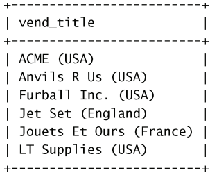
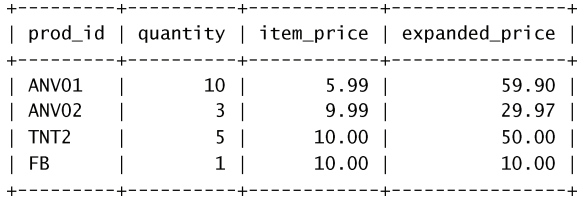
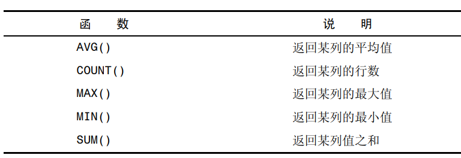
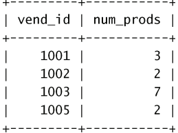
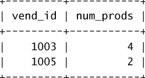
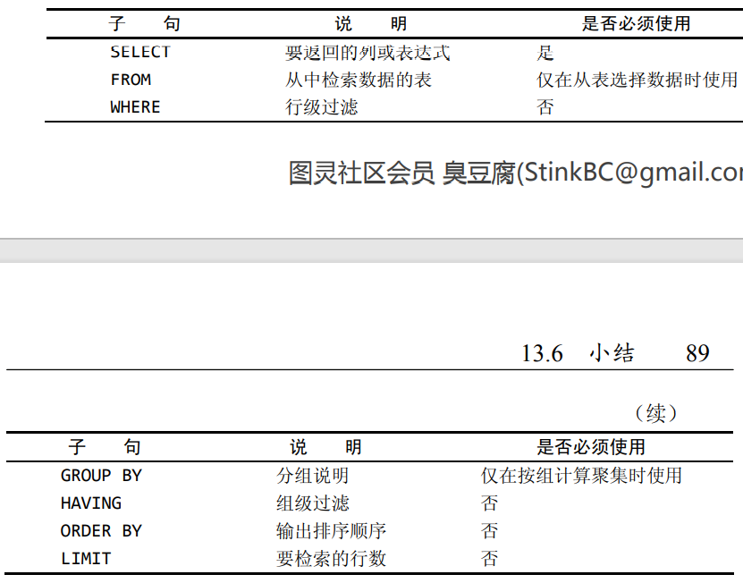
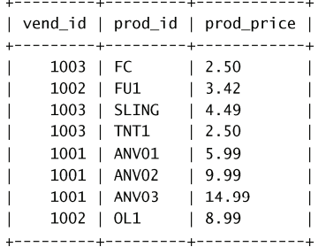
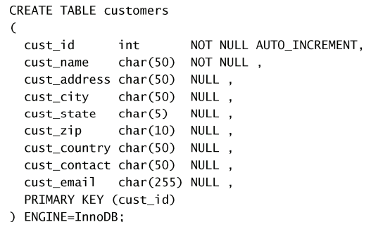
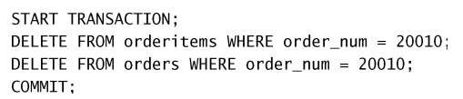

# MySQL笔记

## SELECT语句

使用select语句，必须至少有两条信息，想选择什么，从哪选择。

单个语句结束必须加上分号，SQL语句不区分大小写。

### 检索单个列

```sql
select pro_name from products
```

### 检索多个列

在多个列名并列，使用逗号分隔开来

```sql
select pro_id,pro_name,pro_price from products
```

### 检索所有列

使用通配符'*'来标识所有的列

```sql
select * from products
```

### 检索不同的行

使用select检索某一列时，会将该列中所有行的数据都检索出来，如下图所示


如何检索行值不同的列，使用DISTINCT关键字，只返回行值不同的列

```sql
select distinct vend_id from products
```

DISTINCT关键字默认作用在所有的列上，而不仅仅是前置列。

### 限制结果

LIMIT关键字可以限制返回的行数

```sql
select prod_name from products limit 5,5;
```

选取从第五行开始的五行。MySQL行计数从0开始 ，从行0开始选择，则省略0

## 排序检索数据

### 排序数据

如果希望选择出来的数据根据某个列的值进行排序，可以使用ORDER BY关键字

```sql
select prod_name from products order by prod_name;
```

### 按多个列排序数据

与select选择多列一样，只需用逗号将列名分隔开来即可

```sql
select prod_name from products order by prod_price,prod_name
```

### 指定排序方向

order by关键字的默认排序方向是增序，如果想要降序使用DESC关键字

```sql
select pro_name from products order by prod_prices desc
```

DESC关键字默认只作用于关键字前面的那个列，其与DISTINCT关键字不同，如果想要多个列都适用降序，则在每个列之后都增加DESC关键字。

ORDER　BY关键字与LIMIT搭配使用，可以选择指定的几行，比如说选择价格最低的商品的名字

```sql
select prod_name from products order by prod_price desc limit 1;
```

LIMIT语句应该位于ORDER BY语句之后

## 过滤语句

### WHERE过滤语句

使用select语句时可以用where设置搜索条件


用BETWEEN关键字的时候，需要范围的开始值和结束值，比如

```sql
select prod_name from products where prod_price between 5 and 10
```

在表中，当一个列不包含值，称其为空值NULL，与字段包含0、空字符串或仅仅包含空格不同

WHERE语句也可以用来直接判空

```sql
select prod_name from products where prod_price is NULL
```

ORDER BY语句可以与WHERE语句搭配，置于WHERE语句之后

AND和OR操作符可以用来增加WHERE语句的多样性

```sql
select prod_name from products where prod_id=1 or prod_id=12
select pro_name from products where vend_id=1003 and prod_price<=10;
```

在计算的时候，AND的优先级高于OR的优先级，根据实际情况，对AND或者OR并列的子句进行加括号处理

#### IN关键字

WHERE语句用来指定要匹配值的清单关键字，功能与OR相当

对于IN的合法取值由逗号分隔开全部在圆括号中

```sql
select prod_name from products where vend_id in (1002,1003) order by prod_name
```

为什么要使用IN操作符：

- IN操作符的比OR的执行速度更快
- IN的最大优点是可以包含其他的SELECT语句

#### NOT关键字

WHERE语句中的NOT操作符有且只有一个功能就是否定它之后所跟的任何条件

```sql
select prod_name from products where vend_id not in (1002,1003) order by prod_name
```

### LIKE通配符

使用LIKE关键字以及‘%’符号可以对字符串内容进行模糊匹配，‘%’可以匹配多个甚至0个字符，但是不能匹配NULL内容；‘_’只能匹配单个字符

```sql
select prod_id from products where prod_name like '%anvil%'
select prod_id from products where prod_name like '_nvil'
```

### 正则表达式匹配

正则表达式意义为只要列值中出现我想要匹配的字符，即可进行返回

#### 基本匹配

```sql
select prod_id from products where prod_name regexp '1000'
```

‘.’是正则表达式中的一个特殊字符，可以表示任意内容

#### OR匹配

可以使用OR关键字进行或的匹配

```sql
select prod_id from products where prod_name regexp '1000|2000'
```

#### [ ] 匹配多个字符

```sql
select prod_id from products where prod_name regexp '[123] ton'
```

这里的[123]就是上述关键字OR表示的1|2|3的意思，如果是一个范围，可以用[1-5]这样的形式来表示，不仅仅是数字，字母也可以[a-z]

#### 特殊字符匹配

如果想要匹配‘.’这样的特殊字符如何匹配呢，上面也提到‘.’可以匹配任何字符

使用’\\\‘进行转义

```sql
select prod_id from products where prod_name regexp '\\.'
```

## 拼接字段和别名

选择列时可能会希望将几个列的值并列在一起显示，并且指定为一个新的名字。

拼接的关键字是Concat函数，别名的关键字是AS函数

```sql
select concat(vend_name,' (',vend_country,' )') as vend_title from products order by vend_name
```



## 计算字段

MySQL还可以对检索出来的数据进行数学计算，包括+、*、-、/

```sql
select prod_id,quantity,item_price,quantity*item_price as expanded_price from products where order_num=20005
```



## 聚集函数



```sql
select avg(prod_price) as avg_price from products;
select count(*) as row_sum from products;//count(*)对表中所有的行进行计数，不管表中包含的是空值(NULL)还是非空值
select count(prod_id) as id_num from products;//只对列中具有值的行进行计数，忽略NULL值
select max(prod_price) as max_price from products;
select min(prod_price) as min_price from products;
select sum(prod_price) as sum_price from products;
```

以上五个聚集函数默认都是对所有的行进行计算，如果使用DISTINCT关键字在列名之前，默认只会计算不同的值

```sql
select avg(distinct prod_price) as avg_price from products;//只计算价格不同值的平均值
```

## 数据分组

### 创建分组

创建分组的关键字是DROUP BY，该关键字默认对每个组内的数据进行计算，该关键字必须出现在WHERE之后，ORDER BY语句之前

```sql
select vend_id,count(*) as num_prods from products group by vend_id//统计每个vend_id的数据有多少个
```



### 过滤分组

关键字是HAVING，HAVING关键字支持WHERE的所有操作符，只不过WHERE是作用在行上，其是作用在分组上

```sql
select vend_id,count(*) as num_prods from products where prod_price>=10 group by vend_id having count(*) >=2
```



### 分组和排序

将ORDER　BY和GROUP　BY搭配使用可以对分组的数据进行排序

```sql
select order_num,sum(quantity*item_price) as ordertotal from orderitems group by order_num having sum(quantity*item_price)>=50 order by ordertotal
```

### SELECT子句顺序



## 联结

### 外部联结

外部联结的关键字是外键（foreign key），外键是某个表中的一列，但是是另外一个表的主键值

```SQl
select vend_name，prod_name,prod_price from vecdors,products where vendors.venid =products.venid order by vend_name,prod_name
```

### 内部联结

上述使用SELECT语句联结方式是等值联结，是基于两个表之间的相等测试，这种联结方式也成为内部联结，下面的SQL语句执行和上面的相同功能

```SQL
select vend_name,prod_name,prod_price from ventors inner join products on vecdors.vend_id = products.vend_id
```

## 组合查询

多数SQL查询都只包含从一个或者多个表中返回数据的单条SELECT语句，MYSQL允许执行多个查询（多个SELECT语句）并将结果作为单个查询结果集返回。这种查询的关键字是UNION

假如需要价格小于等于5的所有物品的一个列表，而且供应商1001和1002生产的所有的物品（不考虑价格），sql语句如下

```sql
select vend_id,prod_id,prod_price from products where prod_price <= 5 UNION select vend_id,prod_id,prod_price from products where vend_id in (1001,1002)
```



UNION指示MySQL执行两条语句，并把输出组合成单个查询结果集

UNION执行有几条规则：

- UNION必须由两条或者两条以上的SELECT语句组成，语句之间用关键字UNION分割
- UNION中的每个查询必须包含相同的列、表达式或聚集函数

## 插入数据

### 插入单行数据

插入数据的关键字是INSERT，要求指定表名和被插入到新行中的值。

```sql
insert into customers values(NULL,'pep','100',...)
该例子是插入一个新的用户到用户表中，插入顺序默认是表中列的顺序，对于没有的值使用NULL来代替
```

```sql
insert into customers(cust_name,cust_city,cust_state) values('pep','100 main street','los angels','USA')
该插入语句和上一个插入语句完成同样的工作，但是在表名之后指明了要插入那些列
```

### 插入多行数据

```sql
insert into customers(cust_name,cust_city,cust_state) values(
'pep','Los Angels','USA'
);
insert into customers(cust_name,cust_city,cust_state) values
(
'Mar','New York','USA'
);
```

如果要插入的顺序相同，可以省略多次的INSERT关键字

```sql
insert into customers(cust_name,cust_city,cust_state) values(
'pep','Los Angels','USA'
),
(
'Mar','New York','USA'
);
```

### 插入检索数据

INSERT 关键字可以和SELECT关键字搭配使用，将检索出来的数据插入表中

```sql
insert into customers(cust_id,cust_name,cust_state)
select cust_is,cust_name,cust_state from customers
```

## 更新和删除数据

### 更新数据

关键字是UPDATE，基本的UPDATE关键字有三个部分组成分别是要更新的表名、列名和它们的新值、确定更新行的条件

```sql
update customers set cust_name='Tom' where cust_id=1005
如果不使用where来限制的话，默认是更新所有的行
如果是更新多个列的话，也只是写一个set关键字
update customers set cust_name='Tom',cust_state='USA' where cust_id=1005
```

### 删除数据

删除数据的关键字是DELETE

```SQL
delete from customers wherecust_id=1005
delete关键字通过where来指明删除的是哪一行，如果不指定默认删除所有的行
delete从表中删除所有的行，但是不删除表本身，如果希望删除表本身，使用关键字TRUNCATE
```

## 表的创建更新和删除

### 创建表

关键字是CREATE　TABLE，必须给出以下信息

- 新表的名字，在关键字create table之后给出
- 列的名字和定义，用逗号隔开



主键值必须唯一，如果使用单个列，则它的值必须唯一；如果使用多个列，则这些列的组合值必须唯一

单个列设为主键`primary key(ven_id)`，多个列设为主键值`primary key(order_num,order_item)`

### 更新表

关键字是ALTER，在ALTER TABEL之后应当给出表名，以及要更改的列

```sql
alter table vendors add vend_phone char(20)
alter table vendors drop column vend_phone
```

### 删除表

```sql
drop table customers
```

### 重命名表

```sql
rename table customers to cust
```

## 事务处理

事务处理是一种机制，用来管理必须成批执行的MySQL操作，以保证数据库不包含不完整的操作结果

事务处理的相关术语：

- 事务：	指一组SQL语句
- 回退：撤销指定SQL语句的过程
- 提交：将未存储的SQL语句结果写入数据库表
- 保留点：指事务处理中设置的临时占位符，可以对其发布回退（与回退整个事务处理不同）

MySQL语句通过以下语句来表示事务的开始

```sql
start transaction
```

### 使用ROLLBACK

```sql
select *from ordertotals;
start transaction;
delete from ordertotals;
select * from ordertotals;
rollback;
select * from ordertotals;
```

首先执行一条select语句表明表不是空的，然后开始一个事务处理，用一条delete语句删除ordertotals中的所有行。另外一条select语句验证ordertotals确实为空。这时使用一条rollback语句回退start transaction之后的所有语句，最后一条select语句显示该表不为空。

rollback只能在一个事务内使用（在执行一条start transaction之后），事务管理用来管理insert、update和delete语句，对于create和drop对表进行编辑的语句不能回退

### 使用COMMIT

一般的SQL编辑语句都是直接在表上执行和编写，这就是隐含提交，但是在事务处理当中不存在隐含提交，必须使用COMMIT语句



最后的commit语句仅在上述两条语句不出错的情况下对表进行更改。

