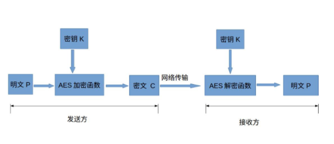

# AES加密

## 算法流程

## 下面介绍各个部分的作用和意义

1. 明文：没有经过加密的数据
2. 密钥K：用来加密明文的密码，在对称加密算法中，加密与解密的密钥是相同的。密钥为接收方与发送方协商产生，但不可以直接在网络上传输，否则会导致密钥泄漏，通常是通过非对称加密算法加密密钥，然后再通过网络传输给对方，或者直接面对面商量密钥。密钥是绝对不可以泄漏的，否则会被攻击者还原密文，窃取机密数据。
3. AES加密函数：设AES加密函数为E，则 C = E(K, P),其中P为明文，K为密钥，C为密文。也就是说，把明文P和密钥K作为加密函数的参数输入，则加密函数E会输出密文C。
4. 密文C：经过加密处理后的数据
5. AES解密函数：设AES解密函数为D，则 P = D(K, C),其中C为密文，K为密钥，P为明文。也就是说，把密文C和密钥K作为解密函数的参数输入，则解密函数会输出明文P。 

## 对称加密和非对称加密

- 对称加密：加密和解密用到的密钥是相同的，这种加密方式加密速度非常快，适合经常发送数据的场合。缺点是密钥的传输比较麻烦。
- 非对称加密：加密和解密用的密钥是不同的，这种加密方式是用数学上的难解问题构造的，通常加密解密的速度比较慢，适合偶尔发送数据的场合。优点是密钥传输方便。常见的非对称加密算法为RSA、ECC和EIGamal

**实际中，一般是通过RSA加密AES的密钥，传输到接收方，接收方解密得到AES密钥，然后发送方和接收方用AES密钥来通信。**

## 代码实现

https://cloud.tencent.com/developer/article/1647808