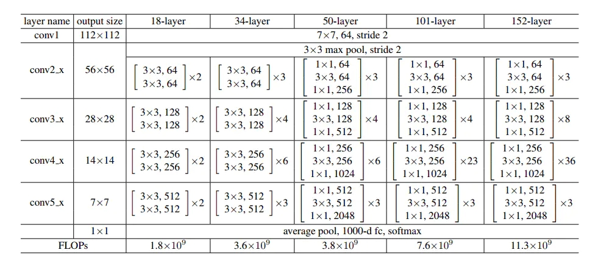
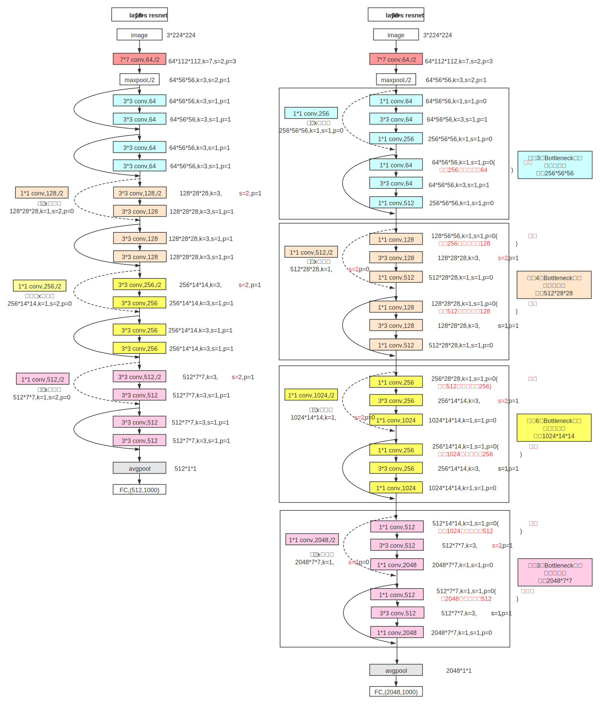

# resnet 学习笔记
## 结构图  

## 网路图  

  

## pytorch内部的代码机制

pytorch内部中将重复性的结构封装成函数，以达到使用最少的代码，实现网络结构 
流程如下: 
   * Basicblock封装(残差块)： 
        * 两次卷积
        * forward函数，其中内涵shortcut连接
   * con3x3卷积核函数：参数有输入和输出通道数，及步长。直接在别处调用该函数即可
   * ResNet函数，继承nn.Moudle:
        * 7x7卷积池化处理-->四个残差块-->avgpool-->fc
        * make_layer函数：
            * downsample设计，内置一个1x1的卷积，方便不同维度间的张量相加
            * 调用block函数，增加残差块
            
***
参考文献 
<https://www.jianshu.com/p/085f4c8256f1>          
      

​    
