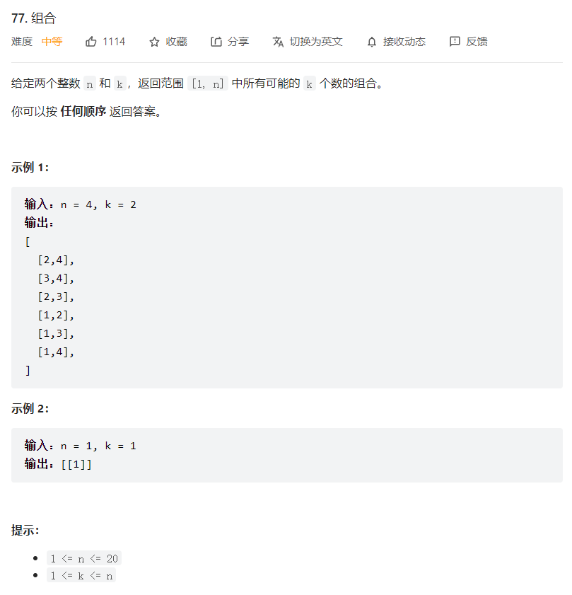

# 回溯法

## 组合

https://leetcode.cn/problems/combinations/



```python
class Solution:
    def combine(self, n: int, k: int) -> List[List[int]]:
        self.ans=[]
        self.cur=[]
        self.backtracking(n,k,1)
        return self.ans

    def backtracking(self,n,k,start):
        if k==0:
            self.ans.append(self.cur[:])
            return
        for i in range(start,n+1):
            if n-start+1<k:
                return 
            self.cur.append(i)
            self.backtracking(n,k-1,i+1)
            self.cur.pop()
        return
```

## 组合总和Ⅲ


```python
class Solution:
    def combinationSum3(self, k: int, n: int) -> List[List[int]]:
        self.ans=[]
        self.cur=[]
        self.backtracking(k,n,1)
        return self.ans

    def backtracking(self,k,n,start):
        if sum(self.cur)==n and k==0:
            self.ans.append(self.cur[:])
            return
        for i in range(start,10):
            self.cur.append(i)
            if sum(self.cur)>n:
                self.cur.pop()
                return
            self.backtracking(k-1,n,i+1)
            self.cur.pop()
        return
```

## 电话号码的字母组合


```python
class Solution:
    def letterCombinations(self, digits: str) -> List[str]:
        if len(digits)==0:
            return []
        self.tmp={}
        self.tmp['2']="abc"
        self.tmp['3']="def"
        self.tmp['4']="ghi"
        self.tmp['5']="jkl"
        self.tmp['6']="mno"
        self.tmp['7']="pqrs"
        self.tmp['8']="tuv"
        self.tmp['9']="wxyz"

        self.ans=[]
        self.cur=[]
        self.backtracking(0,digits)
        return self.ans

    def backtracking(self,startidx,digits):
        if startidx>=len(digits):
            self.ans.append("".join(self.cur[:]))
            return 
        for s in self.tmp[digits[startidx]]:
            self.cur.append(s)
            self.backtracking(startidx+1,digits)
            self.cur.pop()
        return 
```

## 组合总和


```python
class Solution:
    def combinationSum(self, candidates: List[int], target: int) -> List[List[int]]:
        self.ans=[]
        self.cur=[]
        candidates.sort()
        self.backtracking(candidates,target,0)
        return self.ans

    def backtracking(self,candidates,target,startidx):
        if sum(self.cur)>target:
            return 
        if sum(self.cur)==target:
            self.ans.append(self.cur[:])
            return 
        for i in range(startidx,len(candidates)):
            self.cur.append(candidates[i])
            if sum(self.cur)>target:
                self.cur.pop()
                return
            self.backtracking(candidates,target,i)
            self.cur.pop()
        return 
```

## 组合总和Ⅱ


```python
class Solution:
    def combinationSum2(self, candidates: List[int], target: int) -> List[List[int]]:
        self.candidates=sorted(candidates)
        self.target=target
        self.ans=[]
        self.cur=[]
        self.backtracking(0)
        return self.ans

    def backtracking(self,startidx):
        if sum(self.cur)==self.target:
            self.ans.append(self.cur[:])
        for i in range(startidx,len(self.candidates)):
            if i-1 >=startidx and self.candidates[i]==self.candidates[i-1]:
                continue    
            self.cur.append(self.candidates[i])
            if sum(self.cur)>self.target:
                self.cur.pop()
                return
            self.backtracking(i+1)
            self.cur.pop()

        return
```

## 分割回文串


```python
class Solution:
    def partition(self, s):
        self.ans=[]
        self.cur=[]

        self.find(s,0)
        return self.ans

    def find(self,s,start):
        if start>=len(s):
            self.ans.append(self.cur[:])
            return

        for i in range(start,len(s)):
            curS=s[start:i+1]
            if self.isPalindrome(curS):
                self.cur.append(curS)
                self.find(s,i+1)
                self.cur.pop()
            else:
                continue
        return 

    # 判断是否是回文字符串
    def isPalindrome(self,s):
        left=0
        right=len(s)-1
        while left<=right:
            if s[left]!=s[right]:
                return False
            else:
                left+=1
                right-=1
        return True

```

## 复原IP地址


```python
class Solution:
    def restoreIpAddresses(self, s: str) -> List[str]:
        self.ans=[]
        self.cur=""
        self.pointnum=0
        self.backtracking(s,0)
        return self.ans

    def backtracking(self,s,startidx):    
        if startidx>len(s):
            return 
        if startidx==len(s):
            if self.pointnum==4:
                self.ans.append(self.cur[:-1])
            return 
        if self.pointnum==4 and startidx<len(s):
            return
        for i in range(1,4):
            if startidx+i >=len(s):
                ss=s[startidx:len(s)]
            else:
                ss=s[startidx:startidx+i]
            print(startidx)
            if int(ss)>255:
                return
            if int(ss)==0:
                ss+="."
                self.pointnum+=1
                self.cur+=ss
                self.backtracking(s,startidx+i)
                self.cur=self.cur[:-len(ss)]
                self.pointnum-=1
                return
            ss+="."
            self.pointnum+=1
            self.cur+=ss
            self.backtracking(s,startidx+i)
            self.cur=self.cur[:-len(ss)]
            self.pointnum-=1
        return 
```

## 子集


```python
class Solution:
    def subsets(self, nums: List[int]) -> List[List[int]]:
        self.ans=[]
        self.cur=[]
        self.ans.append(self.cur[:])
        self.backtracking(nums,0)
        return self.ans

    def backtracking(self,nums,startidx):
        if startidx>=len(nums):
            return
        for i in range(startidx,len(nums)):
            self.cur.append(nums[i])
            self.ans.append(self.cur[:])
            self.backtracking(nums,i+1)
            self.cur.pop()

        return
```

## 子集Ⅱ


```python
class Solution:
    def subsetsWithDup(self, nums: List[int]) -> List[List[int]]:
        self.ans=[]
        self.cur=[]
        nums.sort()
        self.backtracking(nums,0)

        return self.ans

    def backtracking(self,nums,startidx):
        self.ans.append(self.cur[:])
        if startidx>=len(nums):
            return
        for i in range(startidx,len(nums)):
            if i>startidx and nums[i]==nums[i-1]:
                continue
            self.cur.append(nums[i])
            self.backtracking(nums,i+1)
            self.cur.pop()
        return
```

## 递增子序列

https://leetcode.cn/problems/increasing-subsequences/


```python
class Solution:
    def findSubsequences(self, nums: List[int]) -> List[List[int]]:
        self.ans=[]
        self.cur=[]

        self.backtracking(nums,0)
        return self.ans

    def backtracking(self,nums,startidx):
        if len(self.cur)>=2:
            self.ans.append(self.cur[:])
        if startidx>=len(nums):
            return
        tmp={}
        for i in range(startidx,len(nums)):
            if nums[i] in tmp:
                continue
            tmp[nums[i]]=1
            if len(self.cur)>0 and nums[i]<self.cur[-1]:
                continue
            self.cur.append(nums[i])
            self.backtracking(nums,i+1)
            self.cur.pop()
        return 
```

## [全排列](https://leetcode.cn/problems/permutations/)


```python
class Solution:
    def permute(self, nums: List[int]) -> List[List[int]]:
        self.ans=[]
        self.cur=[]
        self.tmp=[False]*21
        self.backtracking(nums)
        return self.ans

    def backtracking(self,nums):
        if len(self.cur)==len(nums):
            self.ans.append(self.cur[:])
            return
        for i in nums:
            if self.tmp[i+10]:
                continue
            self.cur.append(i)
            self.tmp[i+10]=True
            self.backtracking(nums)
            self.cur.pop()
            self.tmp[i+10]=False
        return
```

## [全排列 II](https://leetcode.cn/problems/permutations-ii/)


```python
class Solution:
    def permuteUnique(self, nums: List[int]) -> List[List[int]]:
        self.ans=[]
        self.tmp=[False]*9
        self.cur=[]
        nums.sort()
        self.backtracking(nums)
        return self.ans

    def backtracking(self,nums):
        if len(nums)==len(self.cur):
            self.ans.append(self.cur[:])
            return
        for i in range(len(nums)):
            if self.tmp[i]:
                continue
            if i>0 and nums[i]==nums[i-1] and self.tmp[i-1]:
                continue
            self.cur.append(nums[i])
            self.tmp[i]=True
            self.backtracking(nums)
            self.cur.pop()
            self.tmp[i]=False
        return 
```

## [重新安排行程](https://leetcode.cn/problems/reconstruct-itinerary/)


```python
class Solution:
    def findItinerary(self, tickets: List[List[str]]) -> List[str]:
        self.tmp=defaultdict(list)
        for i in tickets:
            self.tmp[i[0]].append(i[1])
        self.ans=['JFK']
        self.backtracking(tickets,'JFK')
        return self.ans
        

    def backtracking(self,tickets,start):
        if len(self.ans)==len(tickets)+1:
            return True
        self.tmp[start].sort()

        for cur in self.tmp[start]:
            end=self.tmp[start].pop(0)
            self.ans.append(end)
            if self.backtracking(tickets,end):
                return True 
            self.ans.pop()
            self.tmp[start].append(end)
        return 
```

## [N 皇后](https://leetcode.cn/problems/n-queens/)


```C++
class Solution {
public:
    vector<vector<string>> ans;
    vector<string> cur;
    unordered_map<int,int> tmp;

    vector<vector<string>> solveNQueens(int n) {
        backtracking(n,0);
        return ans;
    }
    void backtracking(int n,int row){
        if(row==n){
            ans.push_back(cur);
            return;
        }
        string s(n,'.');
        for (int i = 0; i < n; ++i) {
            if(tmp.count(i))continue;
            if(check(i,row))continue;
            tmp[i]=row;
            s[i]='Q';
            cur.push_back(s);
            backtracking(n,row+1);
            s[i]='.';
            cur.pop_back();
            tmp.erase(i);         
        }
    }    
    bool check(int i,int row){
        for (auto [k,v]:tmp) {
            if ((abs(i-k)==abs(row-v)))return true;
        }
        return false;
    } 
};
```

