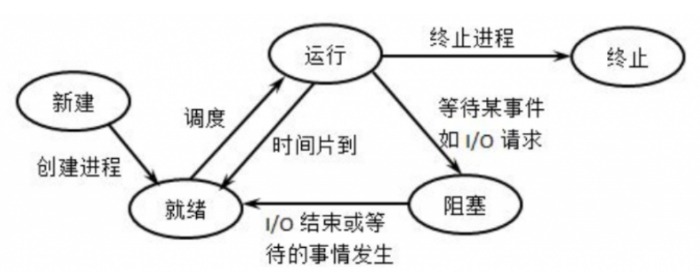
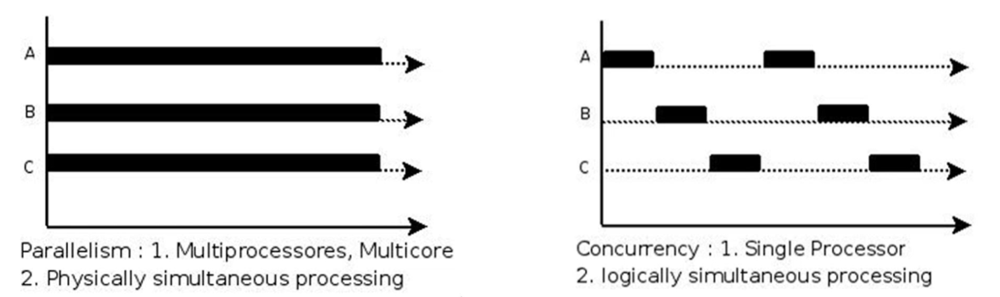
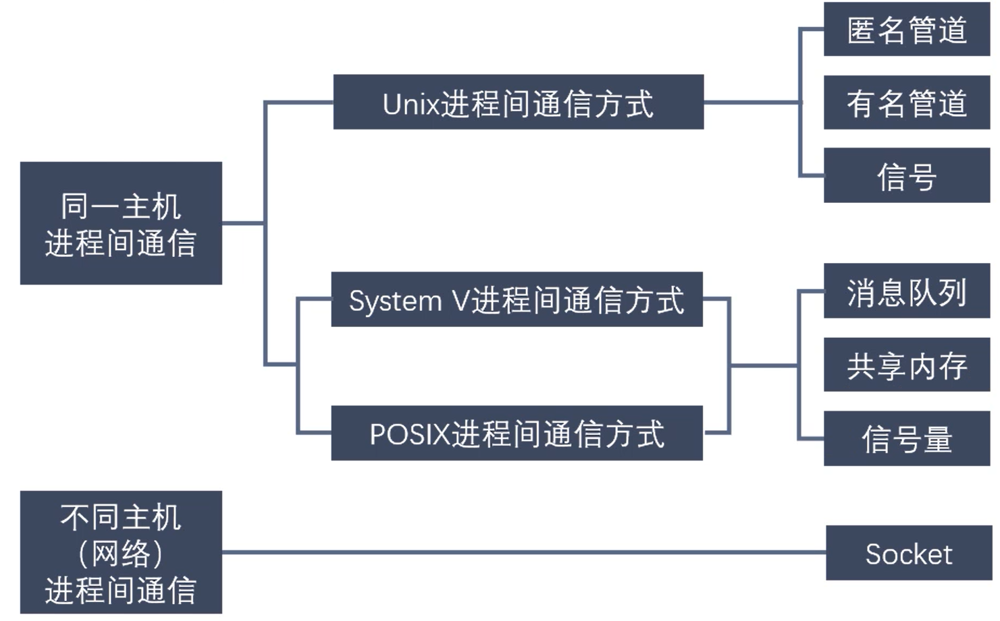
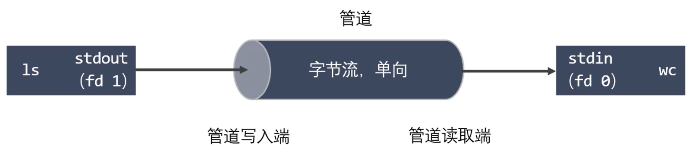
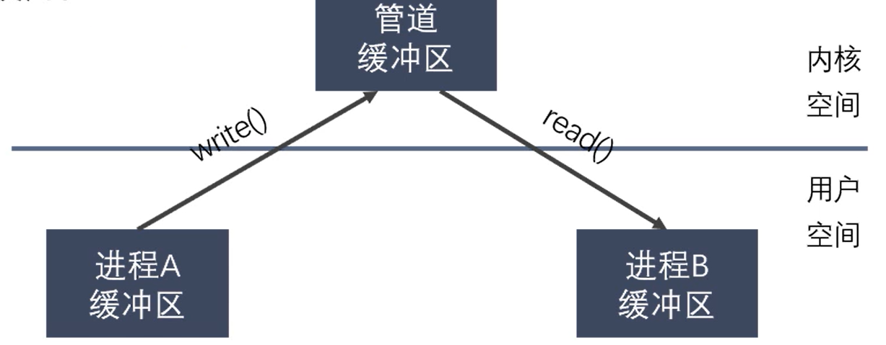

# 操作系统笔记

## 虚拟内存

物理主存的空间大小是有限的，当运行多个进程或者一个进程需要很大内存时空间大小不够，亦或是多个进程将内存分割为多个碎片导致内存不连续，**虚拟内存为每一个进程创建一个连续逻辑内存地址空间**，这个空间有些在主存中，有些在磁盘中，让进程运行的时候指针可以在内部移动的连贯，MMU内存管理单元提供了虚拟内存到物理内存的映射。

Linux中使用**Top**命令查看CPU和MEM使用情况


进入top之后，通过按键**P**按照CPU使用情况排序，按键**M**按照MEM使用情况排序

## 什么是进程？

进程是系统中正在运行的一个应用程序，程序一旦运行就是进程。

进程是系统进行资源分配的最小单位，并且每个进程都拥有独立的地址空间

**一个进程不能直接访问另外一个进程的变量和数据结构**，如果希望访问另外一个进程的资源，需要进行进程间的通信，比如：**管道、消息队列**、**FIFO、共享内存、信号量**

线程是进程的一个实体，是线程的一条执行路径；比进程更小的独立运行的基本单位，线程也被称为轻量级进程，一个程序至少有一个进程，一个进程至少有一个线程。

Linux中查看进程

```
ps aux   //显示所有的进程号
ps ajx   //包括父进程、进程组ID、会话ID 等等
```

### 进程的状态

进程有运行、阻塞、就绪三个基本状态



时间片：是操作系统分配给每个正在运行的进程微观上的一段CPU时间，首先内核会给每个进程分配相等的初始时间片，然后每个进程轮番的执行相应的时间，当所有时间片耗尽时，内核会重新给每个进程计算并分配时间片。

### 进程调度算法

- **先来先服务**调度算法
- **时间片轮转法**调度算法
- **短作业优先**调度算法
- **非抢占式优先级**调度算法
- **抢占式优先级**调度算法
- **高响应比优先**调度算法

## 并行和并发

并行：在同一时刻有多条指令在多个处理器上同时执行

并发：同一时刻只能有一条指令执行，但多个进程的指令被快速切换，使得宏观上具有多个进程同时执行的效果，但在微观上并不是同时执行的，只是把时间分成若干段，使多个进程快速交替执行



## 父子进程对内存空间的使用

使用`pid_t fork()`函数来创建子进程，如果是父进程返回值大于0，如果是子进程返回值是0，如果创建失败返回值为-1。创建失败的原因有用户的进程数达到限制或者内存被用光。

在子线程刚被创建的时候，父子线程共享内存空间，只有当其中某一个进程想要修改数据的时候，才对数据进行拷贝复制，并在拷贝的数据上进行修改，这种方法称为**写时拷贝**。

### 孤儿进程

父进程运行结束，但是子进程还在运行，这样情况下子进程就会成为孤儿进程。每当出现一个孤儿进程，内核就会将孤儿进程的父进程设置为init，init进程就会循环的等待子进程退出，来释放其资源

### 僵尸进程

每个进程结束之后，都会释放自己地址空间中的用户区数据，内核区的PCB没有办法自己释放掉，需要父进程去释放

进程终止时，父进程尚未回收，子进程残留资源（PCB）存放于内核中，变成僵尸进程

僵尸进程不能被 kill -9 杀死

这样就会导致一个问题，因为父进程没有调用wait()函数或者waitpid()函数，保留的PCB信息一直存在，这样进程号就会一直被占用，但是系统中的进程号是有限的，如果存在大量的僵尸进程，将会因为没有可用的进程号导致系统不能产生新的进程

### 进程回收

在每个进程退出的时候，内核释放该进程所有的资源、包括打开的文件、占用的内存等等。但是仍然为其保留一定的信息，主要是控制块PCB中的信息，包括进程号、退出状态、运行时间等等

父进程可以通过调用wait()函数或者waitpid得到退出状态同时彻底清除掉整个进程

wait()和waitpid()函数功能相同，区别在于wait()函数会阻塞，waitpid()函数可以设置不阻塞，并且可以指定等待那个子进程结束

一次wait()或者waitpid()调用只能清理一个子进程，清理多个自己成应当使用循环

## GDB多进程调试

使用GDB调试的时候默认只能跟踪一个进程，可以在命令行中通过指令来设置GDB调试工具来跟踪父进程或者子进程。默认情况下时跟踪父进程的。

设置调试父进程或者子进程：`set follow-fork-mode [parent(默认) | child]`

设置调试模式：`set detach(分离的意思)-on-fork [on | off]`

默认为on表示调试当前进程的时候，其他的进程继续运行；如果是off，调试当前进程的时候，其他的进程被GDB挂起

查看调试的进程：`info inferiors`

切换当前调试的进程：`inferior id`

使进程脱离GDB调试：`detach inferiors id`

### 什么是死锁？

死锁是多个进程循环等待它方占有的资源而无限僵持等待下去的局面，如果没有外力作用死锁涉及到的各个进程将会一直处于封锁状态。

- 互斥条件：某个资源在一段时间内只能由一个进程占有，不能同时被两个或者两个以上的进程占有。必须由正在使用该资源的进程主动释放之后，其他的进程才能够继续使用。
- 不可抢占条件：进程所获得的资源在没有使用完毕之前，资源申请者不能强行的从资源占有者手中夺取资源。
- 占有且申请条件：进程至少占有一个资源，但是又要申请新的资源才能够继续运行，但是所申请的资源被其他的进程正在使用，所以该进程进入堵塞状态，但是在它等待新资源时仍然继续占用已有的资源
- 循环等待条件：存在一个进程等待序列{p1,p2,...pn}，其中p1等待p2占有的资源，p2等待p3占有的资源，形成了一个进程循环等待环

### 进程间通信的方式



#### 管道

管道也成为匿名管道，比如统计一个目录中文件的数目命令：ls | wc -l，为了执行该命令，shell创建两个进程来分别执行ls和wc



特点：

- 管道其实是内核内存中维护的缓冲器，这个缓冲器的存储能力是有限的，不同的操作系统大小不一定相同
- 管道拥有文件的特质：读操作、写操作，匿名管道没有文件实体，有名管道有文件实体，但不存储数据。可以按照文件的方式对管道进行操作
- 一个管道是一个字节流，使用管道时不存在消息或者消息边界的概念，从管道读取数据的进程可以读取任意大小的数据块，而不管写入进程写入管道的数据块大小是多少
- 通过管道传递的数据是顺序的，从管道中读取出来的字节顺序和它们被写入管道的顺序是完全一致的 



- 管道中的数据传递方向是单向的，一端用于写入，一端用于读取，管道是半双工的
- 从管道中读数据是一次性操作，数据一旦被读走，就从管道中被抛弃，释放空间以便写更多的数据，在管道中不能随机的访问数据
- 匿名管道只能在具有公共祖先的进程（父进程和子进程、兄弟进程）之间使用
- 


- 管道：通常是指无名管道，其是半双工的，具有固定的读端和写端，并且只能用于具有亲属关系的进程之间的通信
- FIFO：可以在无关的进程之间交换数据，以一种特殊的设备文件形式存在文件系统中
- 消息队列：是消息的连接表，存放在内核中可以实现消息的随机查询。消息队列是独立于发送和接收进程，进程终止时消息队列及其内容并不会被删除
- 共享内存：指多个进程共享一个给定的存储区，其是最快的一种进程通信方式，因为进程直接对内存进行存取。因为多个进程是同时操作的，所以需要进行同步。通常和信号量结合起来一起使用。
- 信号量： 信号量是一个计数器，用来实现进程间的互斥和同步

### 守护进程

守护进程是运行在后台的一种特殊进程，独立于控制终端并且周期性执行某种任务或者等待处理某些发生的事件

守护进程的特点：

- 守护进程必须是后台运行
- 守护进程必须和其运行的环境隔离开来，这些环境包括未关闭的文件描述符，控制终端，会话和进程组，工作目录以及文件创建掩膜等等
- 守护进程的启动具有特殊之处，可以在Linux系统启动时从脚本/etc/rc.d中启动，可以由作业规划进程crond启动，还可以由用户终端shell中执行

### 进程和线程的区别

- 同一个进程的线程互相之间共享内存地址和资源，但是进程之间的地址和资源是相互独立的
- 一个进程崩溃之后，在保护模式之下不会对其它的进程产生影响，但是一个线程崩溃之后整个进程都会崩溃
- 进程切换消耗的资源很大
- 每个独立的程序都有一个程序的入口和程序出口，但是线程不能独立执行，必须依存在应用程序中

